# Auto Piano - 自动钢琴系统

Auto Piano 是一套完整的钢琴自动化系统，能够将任何来源的钢琴音乐转换为可播放的资产，支持软件可视化模拟和 ESP32 控制的 88 键伺服机构进行真实机械演奏。

系统涵盖从 YouTube 音频下载、AI 钢琴转谱、乐谱生成、视觉模拟到即时硬件控制的完整流程。

---

## 目录

- [安装教学](#安装教学)
- [快速开始](#快速开始)
- [项目概述](#项目概述)
- [系统架构](#系统架构)
- [仓库结构](#仓库结构)
- [硬件架构](#硬件架构)
- [入口与启动器](#入口与启动器)
- [转谱流程](#转谱流程)
- [乐谱数据格式](#乐谱数据格式)
- [ESP32 韧体协议](#esp32-韧体协议)
- [视觉化播放](#视觉化播放)
- [硬件播放](#硬件播放)
- [按钮子系统](#按钮子系统)
- [马达校正](#马达校正)
- [设定文件](#设定文件)
- [歌曲文件与输出资产](#歌曲文件与输出资产)
- [工具](#工具)
- [AI 编曲规则](#ai-编曲规则)
- [依赖项](#依赖项)
- [已知注意事项](#已知注意事项)

---

## 安装教学

### 环境需求

| 项目 | 需求 |
| --- | --- |
| 操作系统 | Windows 10 / 11 |
| Python 版本 | 3.11（安装脚本会自动安装） |
| GPU | NVIDIA 显卡 + CUDA 12.1（用于 ByteDance 转谱模型） |
| 网路 | 首次使用需下载模型文件（约 160MB） |
| 磁盘空间 | 建议至少 5GB（含虚拟环境和模型） |

### 第一步：克隆仓库

```bash
git clone https://github.com/wjmmmwjj/auto_piano.git
cd auto_piano
```

### 第二步：执行安装脚本

在项目根目录双击 `install.bat`，或在命令行执行：

```bash
install.bat
```

安装脚本会自动完成以下所有工作：

```
install.bat 执行流程
====================

  开始
    |
    v
  [检查 .venv311\Scripts\python.exe 是否存在]
    |-- 存在 --> 跳过 Python 安装
    |-- 不存在 -->
          [尝试 py -3.11]
            |-- 找到 --> 使用 py -3.11
            |-- 找不到 -->
                  [用 winget 自动安装 Python 3.11]
                    |-- 成功 --> 继续
                    |-- 失败 --> 需要手动安装 Python 3.11
    |
    v
  [建立 .venv311 虚拟环境]
    |
    v
  [升级 pip / setuptools<82 / wheel]
    |
    v
  [安装 PyTorch CUDA 12.1]
  torch>=2.0.0, torchaudio>=2.0.0, torchvision>=0.15.0
  来源: https://download.pytorch.org/whl/cu121
    |
    v
  [安装 playback/requirements.txt + pygame]
  包含: yt-dlp, pretty_midi, music21, pyserial,
        requests, imageio-ffmpeg, piano_transcription_inference,
        basic-pitch, pydub, moduleconf
    |
    v
  [安装 transkun（--no-deps）]
    |
    v
  安装完成
  可以执行 run_score.bat / run_visualizer.bat / sound.bat / tool.bat
```

### 第三步：验证安装

安装完成后，执行以下命令确认环境正确：

```bash
run_score.bat
```

如果看到选单画面（播放已有歌曲 / 查歌并自动转谱 / 离开），表示安装成功。

### 手动安装 Python 3.11（如果自动安装失败）

1. 前往 https://www.python.org/downloads/release/python-3119/
2. 下载 Windows installer (64-bit)
3. 安装时勾选 "Add Python to PATH"
4. 安装完成后重新执行 `install.bat`

### 常见安装问题排除

| 问题 | 解决方式 |
| --- | --- |
| `winget` 不存在 | 手动安装 Python 3.11 后重新执行 `install.bat` |
| PyTorch 安装失败 | 确认 NVIDIA 驱动已更新到支持 CUDA 12.1 的版本 |
| `transkun` 安装失败 | 通常是网络问题，请重新执行 `install.bat` |
| 模型下载失败 | 首次执行转谱时会自动下载，确认网络连线正常 |
| 反病毒软件拦截 | 将项目目录加入白名单 |

---

## 快速开始

```
1. 安装环境
   install.bat

2. 从 YouTube 转谱
   run_score.bat
   --> 选择 [2] 查歌并自动转谱
   --> 输入歌曲名称或 YouTube 网址
   --> 等待转谱完成
   --> 选择 [1] 模拟播放 或 [2] 真实弹奏

3. 播放已有歌曲（视觉模拟）
   run_visualizer.bat
   --> 选择 songs/ 目录下的 .py 文件

4. 播放已有歌曲（实体钢琴）
   run_score.bat
   --> 选择 [1] 播放已有歌曲
   --> 选择歌曲
   --> 连接 ESP32（自动侦测）
   --> 开始播放

5. 校正伺服马达
   （先将 motor_control_tool.ino 烧录到 ESP32）
   tool.bat
   --> 输入: <midi> <release角度> <press角度>
   --> 角度会自动写回 motor_control.ino
```

---

## 项目概述

Auto Piano 有两条主要流程线：

**转谱流程线**
从歌曲名称或 YouTube 网址出发，找到音源、下载音频、进行 AI 钢琴转谱、产生 MIDI，再将 MIDI 转换为项目自己的 `SCORE`、`ESP32_LINES`、MusicXML、PDF 与 `songs/*.py`。

**硬件播放流程线**
将已有的 `songs/*.py` 或 `.esp32.txt` 命令文件传送到 ESP32，由 ESP32 控制 88 个伺服机构按下实体钢琴键。

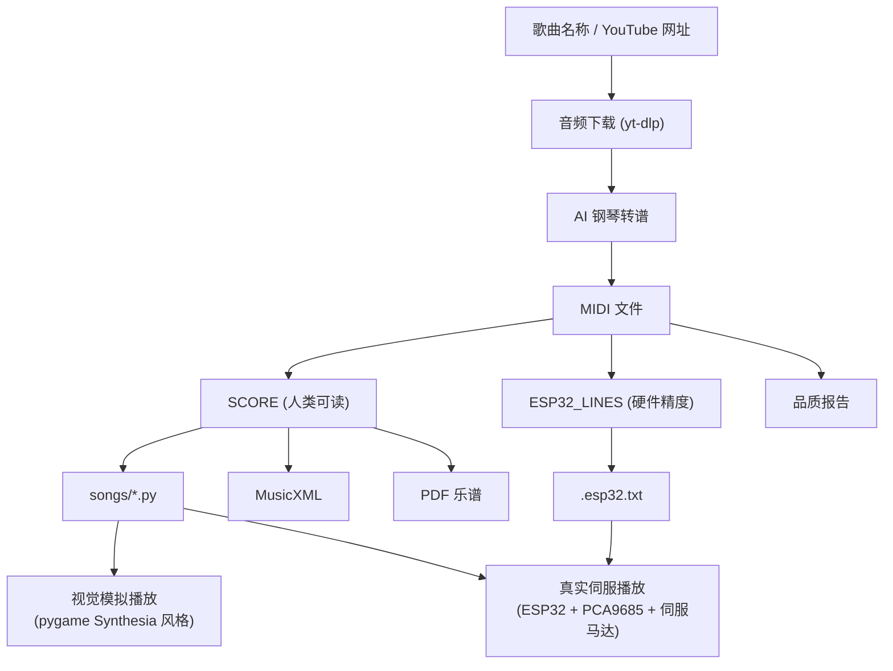

---

## 系统架构

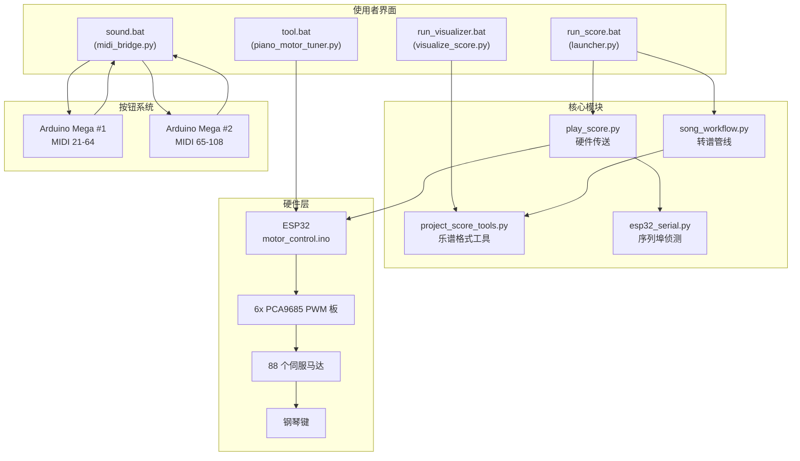

---

## 仓库结构

```
auto_piano/
|
|-- install.bat                    环境安装脚本
|-- run_score.bat                  互动式主入口启动器
|-- run_visualizer.bat             视觉化播放启动器
|-- sound.bat                      按钮转 MIDI 桥接启动器
|-- tool.bat                       马达校正工具启动器
|-- AI_composition_rules.txt       AI 编曲与转谱规则
|
|-- apps/
|   |-- launcher.py                主互动入口
|   |-- visualize_score.py         Synthesia 风格钢琴视觉化播放器
|   |-- piano_motor_tuner.py       互动式伺服角度校正工具
|   |-- dashboard.py               仪表板应用
|
|-- playback/
|   |-- song_workflow.py           核心转谱管线（最大的文件）
|   |-- play_score.py              硬件播放（传送命令到 ESP32）
|   |-- project_score_tools.py     SCORE 格式辅助函式与转换器
|   |-- esp32_serial.py            序列埠侦测与探测
|   |-- model_runtime_config.json  模型与设备设定
|   |-- song_aliases.json          歌曲别名字典
|   |-- song_source_overrides.json 手动指定 YouTube 网址
|   |-- song_source_cache.json     搜寻结果快取
|   |-- requirements.txt           Python 套件需求
|   |-- outputs/                   运行时产出（已列入 gitignore）
|
|-- songs/
|   |-- *.py                       歌曲文件（包含 28 首示范歌曲）
|
|-- esp32/
|   |-- motor_control/
|   |   |-- motor_control.ino      正式 88 键播放韧体
|   |-- motor_control_tool/
|   |   |-- motor_control_tool.ino 校正用韧体
|   |-- reset_all/
|       |-- reset_all.ino          重置/测试韧体
|
|-- button/
|   |-- mega_buttons_1/
|   |   |-- mega_buttons_1.ino     Arduino Mega #1（MIDI 21-64）
|   |-- mega_buttons_2/
|   |   |-- mega_buttons_2.ino     Arduino Mega #2（MIDI 65-108）
|   |-- mega_pin_tester/           脚位测试韧体
|   |-- midi_bridge.py             按钮转 MIDI 桥接（Python）
|
|-- tools/
|   |-- rebuild_all_songs.py       批次从现有 MIDI 重建所有歌曲
|   |-- ino_config_editor.py       编辑 motor_control.ino 角度表
|
|-- archive/                       旧版原型文件
|-- docs/                          文件资料
|-- .models/                       模型权重文件（已列入 gitignore）
|-- .venv311/                      Python 3.11 虚拟环境（已列入 gitignore）
```

---

## 硬件架构

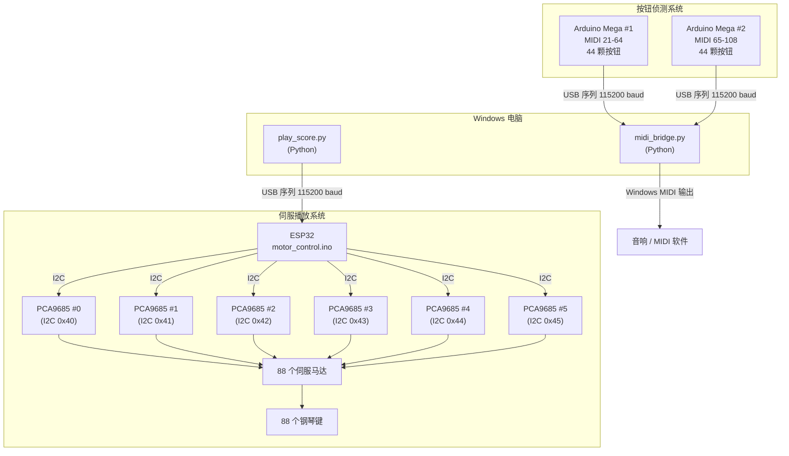

**硬件规格：**

| 项目 | 规格 |
| --- | --- |
| MIDI 音域 | 21 (A0) 到 108 (C8)，完整 88 键 |
| 伺服通道数 | 88 |
| PCA9685 板 | 6 块（I2C 地址 0x40 到 0x45） |
| 白键按下角度 | 30 度 |
| 黑键按下角度 | 40 度 |
| 所有键释放角度 | 0 度 |
| Arduino Mega 按钮板 | 2 块（用于实体按键侦测） |

---

## 入口与启动器

### run_score.bat - 互动式主入口

启动 `apps/launcher.py`。

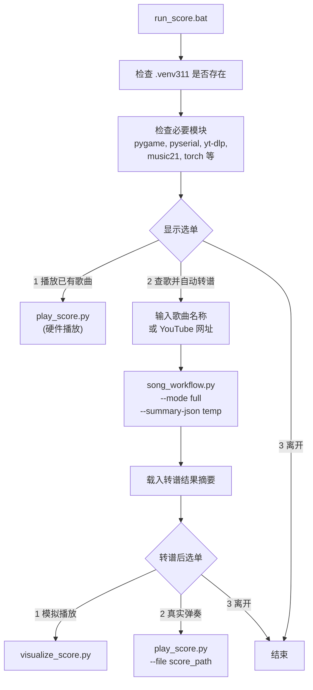

### run_visualizer.bat - 视觉化播放

启动 `apps/visualize_score.py`。

- 如果没有给参数，会开启文件选择对话框
- 载入 `songs/*.py` 并以 Synthesia 风格渲染下落音符，60 FPS
- 如果文件内有 `ESP32_LINES` 则优先使用（时间更精准），否则退回 `SCORE`
- 左手显示蓝色、右手显示黄色、双手显示绿色
- 显示进度条与时间计数器
- 如果系统有预设 MIDI 输出设备，会同步发声

### sound.bat - 按钮转 MIDI 桥接

启动 `button/midi_bridge.py`。

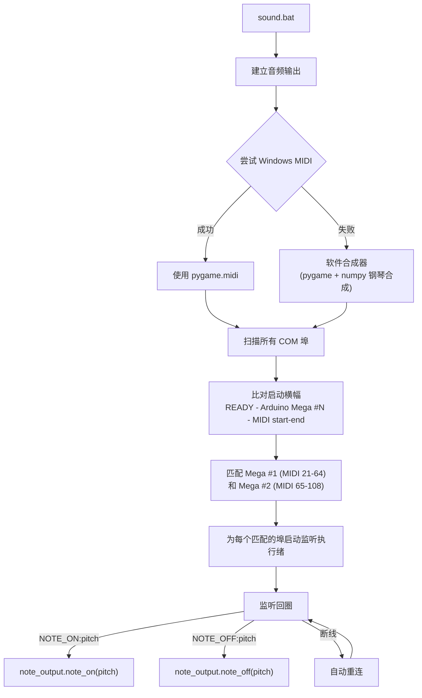

### tool.bat - 马达校正

启动 `apps/piano_motor_tuner.py`。

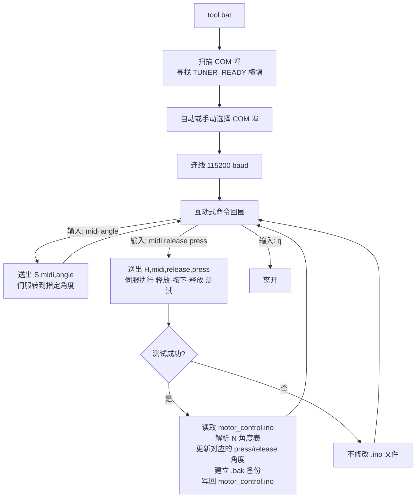

---

## 转谱流程

核心实作在 `playback/song_workflow.py`。

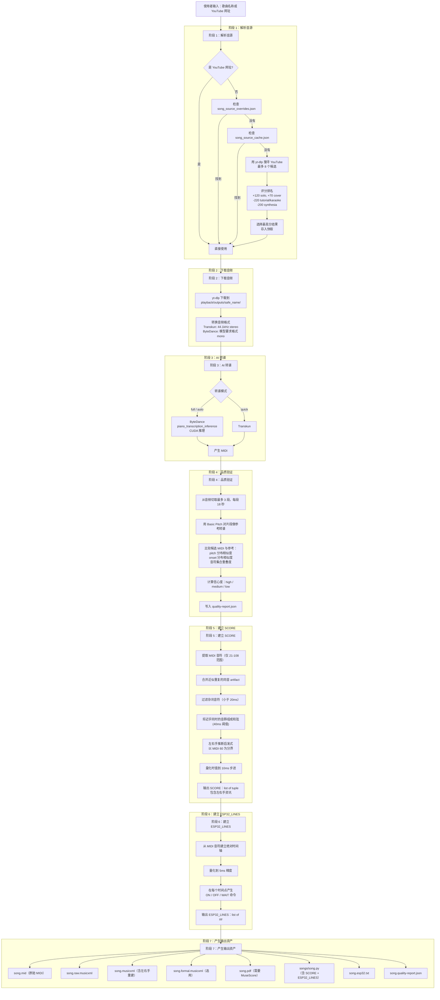

### 转谱提供者

| 提供者 | 模式 | 目前状态 |
| --- | --- | --- |
| ByteDance piano_transcription_inference | full / auto | 预设主路径 |
| Transkun | quick | 可用（快速模式） |
| HuggingFace 远端 | - | 程式码存在，非预设 |
| Songscription.ai | - | 程式码存在，非预设 |
| Basic Pitch | 仅用于验证 | 用于品质评分 |

---

## 乐谱数据格式

项目使用两种内部数据格式，各有互补用途。

### SCORE 格式

`SCORE` 是 `list[tuple]`，以人类可读、区分左右手的格式呈现音乐内容。设计目标是方便编辑、版本控制和 AI 生成。

```python
from playback.project_score_tools import r, n, c, a, ln, rn, lc, rc, la, ra

SCORE = [
    r(120),                        # 休止 120ms
    ln("C3", 600),                 # 左手音符 C3, 600ms
    rn("C5", 600),                 # 右手音符 C5, 600ms
    rc("C5 E5 G5", 900),           # 右手和弦, 900ms
    ra("C5 E5 G5 C6", 800, [0, 20, 40, 60], 10),  # 右手分解和弦
]
```

**辅助函式：**

| 函式 | 说明 |
| --- | --- |
| `r(ms)` | 休止 |
| `n(pitch, ms)` | 单音（无分手） |
| `c(pitches, ms)` | 和弦（无分手） |
| `a(pitches, ms, offsets, release_ms)` | 分解和弦（无分手） |
| `ln(pitch, ms)` | 左手单音 |
| `rn(pitch, ms)` | 右手单音 |
| `lc(pitches, ms)` | 左手和弦 |
| `rc(pitches, ms)` | 右手和弦 |
| `la(pitches, ms, offsets, release_ms)` | 左手分解和弦 |
| `ra(pitches, ms, offsets, release_ms)` | 右手分解和弦 |

**可接受的音高格式：**
- MIDI 整数：`60`
- 音名：`"C4"`、`"G#3"`、`"Eb4"`
- 多音字串：`"C4 E4 G4"`

**原始 tuple 类型对照：**

| kind | tuple 形式 | 说明 |
| --- | --- | --- |
| 0 | `(0, duration_ms)` | 休止 |
| 1 | `(1, pitch, duration_ms)` | 单音 |
| 3 | `(3, [p1, p2, ...], duration_ms)` | 和弦 |
| 4 | `(4, [p1, p2, ...], duration_ms, offsets_ms, release_ms)` | 分解和弦 |
| 10 | `(10, 'L'/'R', pitch, duration_ms)` | 左右手单音 |
| 11 | `(11, 'L'/'R', [p1, p2, ...], duration_ms)` | 左右手和弦 |
| 12 | `(12, 'L'/'R', [p1, p2, ...], duration_ms, offsets_ms, release_ms)` | 左右手分解和弦 |

**project_score_tools.py 的正规化规则：**
- 音高範围限制在 MIDI 21-108
- 时值量化到 10ms 步进
- 最短音长保底 100ms（用于新生成乐谱）
- 和弦最多 12 个音
- 分解和弦 offset 正规化：最小 5ms，最大展开 120ms
- 合并相邻休止
- 重复同音给予机械 release 间隙（15-60ms）

### ESP32_LINES 格式

`ESP32_LINES` 是 `list[str]`，直接代表硬件命令时间轴。设计目标是精准播放，无需再解读。

```
WAIT,120
ON,60+64+67
WAIT,90
OFF,60+64+67
WAIT,50
ON,72
WAIT,400
OFF,72
```

**命令：**

| 命令 | 说明 |
| --- | --- |
| `WAIT,<ms>` | 等待指定毫秒 |
| `ON,<p1+p2+...>` | 同时按下一个或多个键 |
| `OFF,<p1+p2+...>` | 同时释放一个或多个键 |

**特性：**
- 时间轴精度：5ms 量化
- 直接从 MIDI 音符事件时间戳建立
- 保留原始转谱的精确音符起止时间
- 比从 SCORE 反推时间更精准

### SCORE 与 ESP32_LINES 的比较

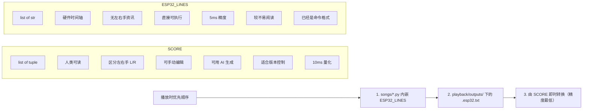

---

## ESP32 韧体协议

正式韧体位于 `esp32/motor_control/motor_control.ino`。

### 键对照表结构

`N[][7]` 表的每一列：

```
{MIDI, board, channel, p0, p180, press_angle, release_angle}
```

| 栏位 | 说明 |
| --- | --- |
| `MIDI` | MIDI 音高编号（21-108） |
| `board` | PCA9685 板索引（0-5） |
| `channel` | 该板上的通道（0-15） |
| `p0` | 对应 0 度的 PWM 脉宽 |
| `p180` | 对应 180 度的 PWM 脉宽 |
| `press_angle` | 按下时角度（白键 30，黑键 40） |
| `release_angle` | 释放时角度（所有键均为 0） |

### 韧体支援的命令

| 命令 | 回应 | 说明 |
| --- | --- | --- |
| `PING,0` | `READY` | 握手 / 健康检查 |
| `SAFEZERO,<ms>` | `OK` | 缓慢归零所有 88 键，每键间隔 ms |
| `WAIT,<ms>` | `OK` | 等待指定毫秒 |
| `ON,<p1+p2+...>` | `OK` | 按下一个或多个键 |
| `OFF,<p1+p2+...>` | `OK` | 释放一个或多个键 |
| `NOTE,<pitch>,<ms>` | `OK` | 单音播放 |
| `CHORD,<p1+p2+...>,<ms>` | `OK` | 和弦播放 |
| `ARP,<notes>,<ms>,<offsets>,<release_ms>` | `OK` | 分解和弦播放 |
| `L:...` / `R:...` | `OK` | 左右手前缀（韧体当作一般命令解析） |

错误回应：`ERR:<讯息>`
资讯讯息：`INFO:<讯息>`、`WARN:<讯息>`

### 命令管线协议

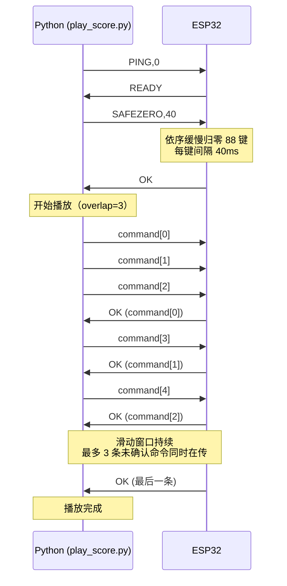

`overlap=3` 参数表示最多 3 条未被确认的命令同时在传输中，避免序列延迟造成播放时间间隙。

---

## 视觉化播放

`apps/visualize_score.py` 渲染 Synthesia 风格的下落音符视觉化。

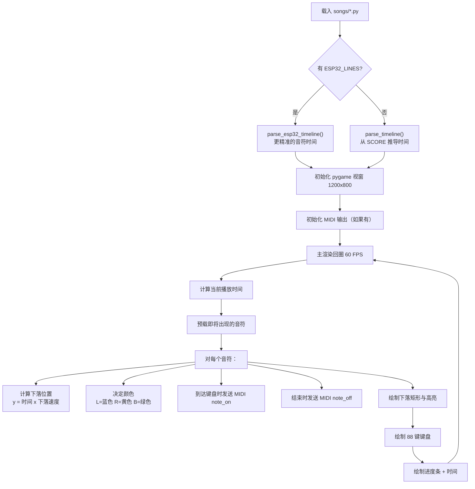

**视窗布局：**
- 上方区域（0 到 650px）：音符下落区
- 进度条：顶部（y=18，高 18px）
- 键盘：视窗底部 150px
- 下落速度：0.6 像素/毫秒

---

## 硬件播放

`playback/play_score.py` 负责将命令传送到 ESP32。

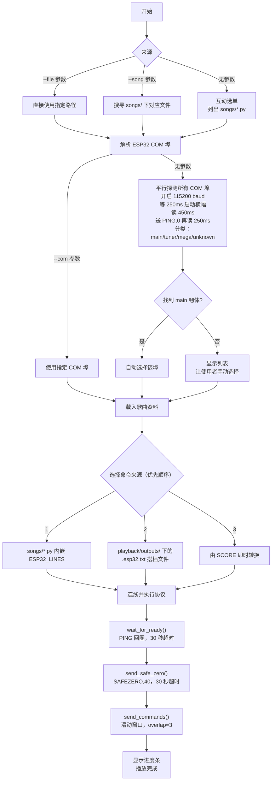

---

## 按钮子系统

按钮子系统让实体钢琴按键触发 MIDI 输出，使用两块 Arduino Mega。

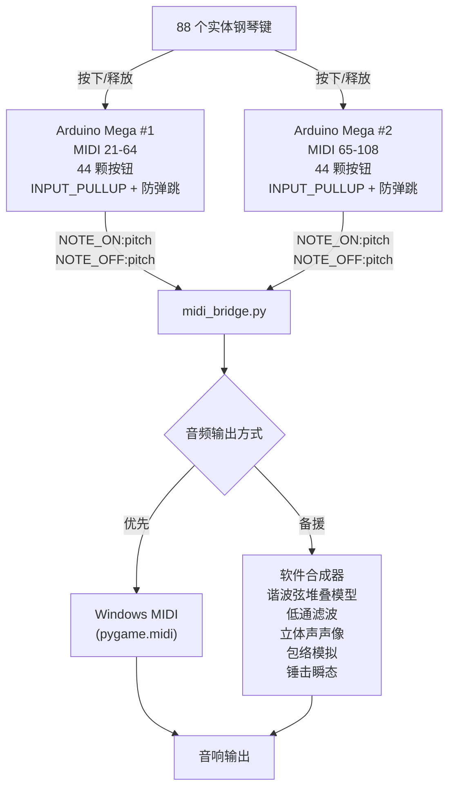

**Arduino 韧体特色（mega_buttons_1/2.ino）：**
- 所有按钮脚位使用 `INPUT_PULLUP`
- 硬件防弹跳，可设定最小按压间隔
- 启动横幅：`READY - Arduino Mega #N - MIDI start-end`
- 输出格式：`NOTE_ON:<pitch>` 和 `NOTE_OFF:<pitch>`

**软件合成器特色（midi_bridge.py SoftwareSynthOutput）：**
- 谐波弦堆叠模型（7 个谐波）
- 非谐性模拟
- 低通滤波（音色温暖化）
- 依 MIDI 音高做立体声声像定位
- attack、body decay、brightness decay 包络
- 锤击杂讯瞬态模拟
- 重触时交叉淡出

---

## 马达校正

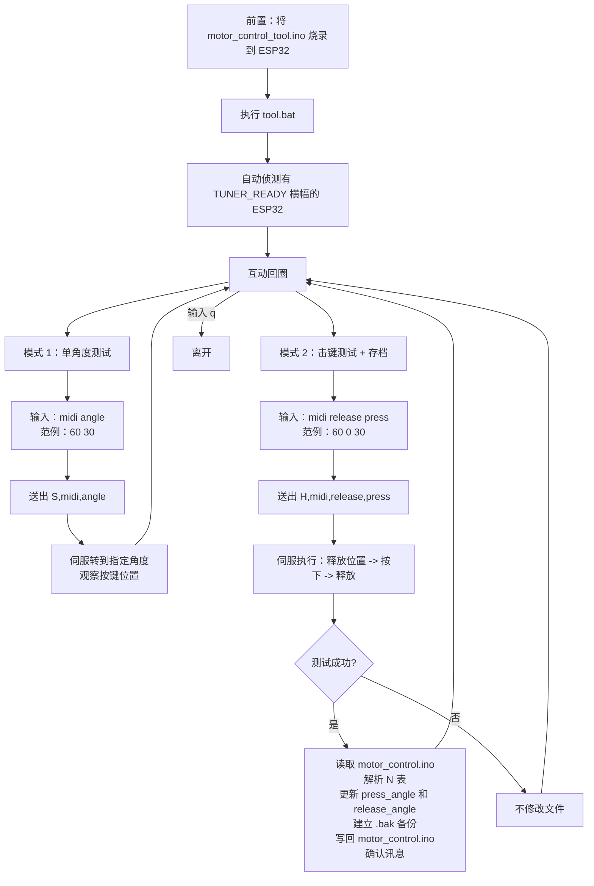

---

## 设定文件

### playback/model_runtime_config.json

```json
{
  "prefer_device": "auto",
  "bytedance_checkpoint_path": ".models/piano_transcription_inference-1.0.0-2020-09-16.pth",
  "transkun_command": "",
  "midi2scoretransformer_command": ""
}
```

| 栏位 | 可选值 | 说明 |
| --- | --- | --- |
| `prefer_device` | `auto`, `cpu`, `cuda` | 推理设备选择 |
| `bytedance_checkpoint_path` | 相对或绝对路径 | ByteDance 模型权重路径 |
| `transkun_command` | 命令字串或空白 | 自订 transkun 呼叫方式（空白则自动侦测） |
| `midi2scoretransformer_command` | 命令范本或空白 | 选用的後处理工具命令 |

`midi2scoretransformer_command` 支援的占位符：
`{midi_path}`、`{output_musicxml_path}`、`{output_dir}`、`{song_name}`、`{safe_name}`

### playback/song_aliases.json

定义已知歌曲的替代搜寻名称与评分关键字。

```json
{
  "黑键练习曲": {
    "aliases": ["Chopin Black Key Etude", "Chopin Etude Op.10 No.5"],
    "search_queries": ["黑键练习曲 肖邦 钢琴独奏"],
    "preferred_terms": ["黑键练习曲", "Chopin", "Etude"],
    "blocked_terms": ["JJ Lin", "林俊杰"]
  }
}
```

### playback/song_source_overrides.json

手动将歌曲名称固定到特定 YouTube 网址，跳过搜寻。

### playback/song_source_cache.json

自动维护的 YouTube 搜寻结果快取，避免重复搜寻。

---

## 歌曲文件与输出资产

### songs/*.py 格式

`songs/` 下的每个歌曲文件都是 Python 模块，包含 `SCORE` 及选用的 `ESP32_LINES`。

```python
from playback.project_score_tools import r, n, c, a, ln, rn, lc, rc, la, ra

SCORE = [
    r(120),
    ln("C3", 600),
    rn("C5", 600),
    rc("C5 E5 G5", 900),
]

ESP32_LINES = [
    "WAIT,120",
    "ON,48",
    "ON,72",
    "WAIT,600",
    "OFF,48+72",
    "ON,72+76+79",
    "WAIT,900",
    "OFF,72+76+79",
]
```

**目前包含 28 首示范歌曲，例如：**
- River Flows In You
- Moonlight Sonata 3rd Movement（月光奏�的曲 第三乐章）
- Evangelion（新世纪福音战士）
- Rush E
- Interstellar Experience（星际效应）
- NewJeans
- YOASOBI - Idol（偶像）
- Night of Knights
- Croatian Rhapsody（克罗埃西亚狂想曲）
- Liszt - La Campanella（李斯特 - �的）
- 天空之城
- 菊次的的夏天
- 大黄蜂
- 冬风
- 小狗圆舞曲
- 黑键练习曲
- 等等

### playback/outputs/< song >/ 结构

每次转谱会在对应目录产生一整组资产：

```
playback/outputs/<safe_song_name>/
|-- <song>.source-url.txt              使用的 YouTube 网址
|-- <song>.source-info.json            YouTube 後设资料
|-- <song>.wav 或 <song>.mp3           下载的音频
|-- <song>.mid                         转谱产生的原始 MIDI
|-- <song>.raw.musicxml                由原始 MIDI 直接转出
|-- <song>.musicxml                    含左右手重建的版本
|-- <song>.formal.musicxml             选用：後处理版本
|-- <song>.pdf                         选用：PDF 乐谱（需要 MuseScore）
|-- <song>.esp32.txt                   硬件命令时间轴
|-- <song>.quality-report.json         转谱品质信心报告
|-- <song>.candidate-summary.json      多提供者比较资料
|-- _validation/                       验证用音频片段
```

### .gitignore

以下内容排除在版本控制之外：
- `.venv*/` - 虚拟环境
- `.models/` - 模型权重文件
- `playback/outputs/` - 所有运行时转谱产出
- `__pycache__/` - Python 位元码快取
- `config/_songscription_*.json` - 私密 API 会话资料

---

## 工具

### tools/rebuild_all_songs.py

从 `playback/outputs/` 内现有的 MIDI 文件批次重建所有歌曲资产。适用于修改 `build_project_score()` 或 `build_esp32_playback_lines()` 逻辑後的批次更新。

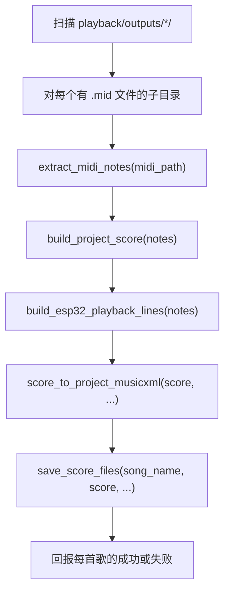

### tools/ino_config_editor.py

离线编辑 `motor_control.ino` 伺服角度表。可以在没有连接 ESP32 的情况下编辑每个 MIDI 键的 board、channel、press、release 值。存档前会建立 `.bak` 备份。

---

## AI 编曲规则

`AI_composition_rules.txt` 定义了转谱精确度与手动乐谱编辑的标准规则。主要原则：

**音乐优先顺序：**
1. 旋律精确度与辨识度是最高优先
2. 钢琴可演奏性优先于机械完整性
3. 对于非钢琴来源，产生合理的钢琴改编版

**时间规则：**
- SCORE 量化：10ms 基本单位
- ESP32 精度：5ms
- 最短建议音长：40ms
- 最长音长：30000ms
- 休止不可全部删除，节奏空间必须保留

**左右手分配：**
- 低音区：优先左手
- 高音区：优先右手
- 中间音：依上下文判断
- 密集时优先顺序：主旋律 > 低音根音 > 和声色彩音 > 内声

**机构限制：**
- 白键按下角度：30 度
- 黑键按下角度：40 度
- 所有键释放角度：0
- 每次播放前必须先 SAFEZERO
- 快速重打须考虑伺服回弹极限

---

## 依赖项

### Python 套件（由 install.bat 安装）

| 套件 | 用途 |
| --- | --- |
| `torch`, `torchaudio`, `torchvision` | ByteDance 模型的 CUDA 推理 |
| `piano_transcription_inference` | ByteDance 转谱模型 |
| `transkun` | Transkun 转谱模型 |
| `basic-pitch` | 用于品质验证的参考转谱 |
| `yt-dlp` | YouTube 搜寻与音频下载 |
| `pretty_midi` | MIDI 文件解析 |
| `music21` | MusicXML 生成 |
| `pyserial` | 与 ESP32 和 Arduino 的序列通讯 |
| `pygame` | 视觉化渲染与 MIDI 输出 |
| `imageio-ffmpeg` | 音频格式转换 |
| `pydub` | 音频前处理 |
| `requests` | HTTP 操作 |
| `moduleconf` | 模块设定 |
| `numpy` | 音频合成（软件钢琴） |

### 额外运行时依赖

| 套件 | 使用位置 | 备注 |
| --- | --- | --- |
| `librosa` | song_workflow 部分路径 | 未列在 requirements.txt |
| `gradio_client` | HuggingFace 路径（非预设） | 选用 |
| `playwright` | Songscription 路径（非预设） | 选用 |

### Arduino / 硬件

| 组件 | 函式库 / 韧体 |
| --- | --- |
| ESP32 | Wire.h (I2C)，自订 PCA9685 控制 |
| PCA9685 | 直接 I2C 暂存器写入 |
| Arduino Mega | 标准 Arduino 函式库 |

---

## 已知注意事项

**转谱模式映射**
`song_workflow.py` 中的 `auto` 模式在 `transcribe_audio()` 开头就被直接改成 `full`。这表示 `auto` 和 `full` 目前完全等价，都使用 ByteDance 作为唯一的主动提供者。多候选比较逻辑存在于程式码中，但在预设 launcher 路径中不会被触发。

**HuggingFace 与 Songscription 路径**
`transcribe_with_huggingface()` 和 `transcribe_with_songscription()` 已在 `song_workflow.py` 中实作，但不会被预设 launcher 流程呼叫。如需重新启用，须更新 `transcribe_audio()` 中的模式分派逻辑。

**缺少的依赖声明**
部分运行时使用的套件（`librosa`、`gradio_client`、`playwright`）未列在 `playback/requirements.txt` 中。它们或是作为间接依赖被安装，或属于非预设的程式码路径。

**ByteDance 模型下载**
模型检查点（约 160MB）在首次使用时会从 Zenodo 或 HuggingFace 自动下载。下载前会验证 SHA256 校验码。失败或不完整的下载会被侦测到并重新下载。

**PDF 汇出需要 MuseScore**
PDF 汇出需要安装 MuseScore 3 或 4。系统会自动搜寻标准安装路径。如果找不到，PDF 生成会静默跳过。

**仅支援 Windows**
本项目严格为 Windows 设计。`install.bat`、MIDI 桥接中的 `winmm` API、`winget` Python 安装、以及所有 `.bat` 启动器都是 Windows 专用。

**校正韧体**
马达校正工具（`tool.bat`）需要将 `motor_control_tool.ino` 烧录到 ESP32。正式的 `motor_control.ino` 韧体不支援 `S,<midi>,<angle>` 或 `H,<midi>,<release>,<press>` 校正命令。
