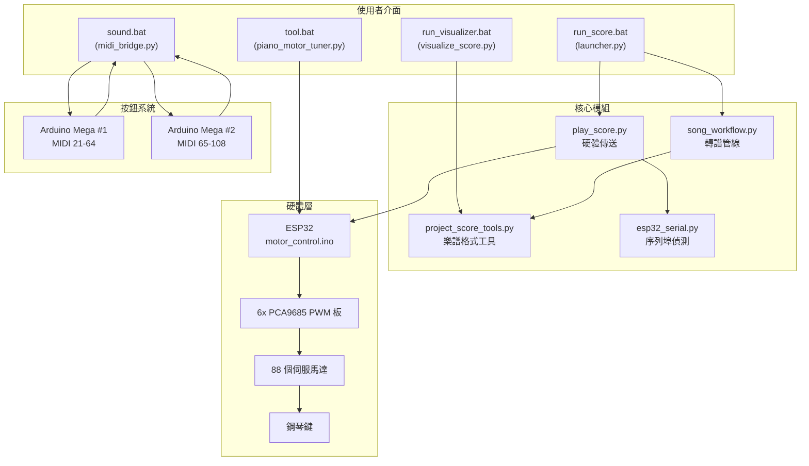
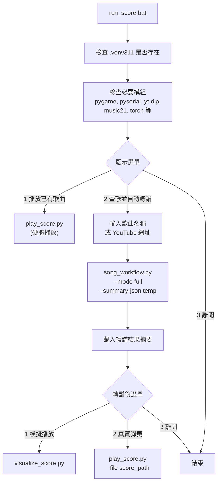
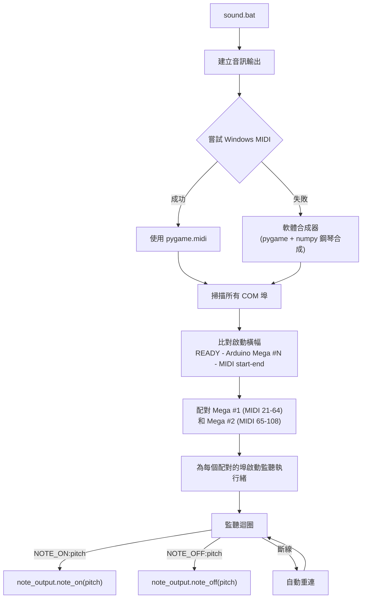
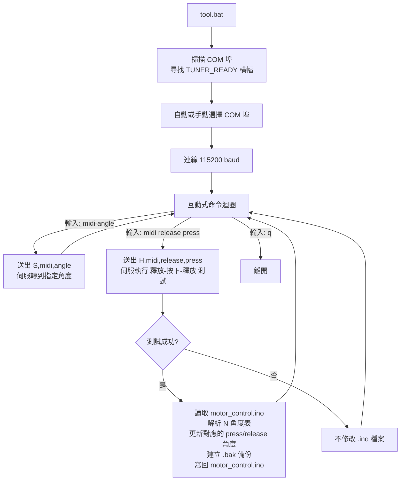
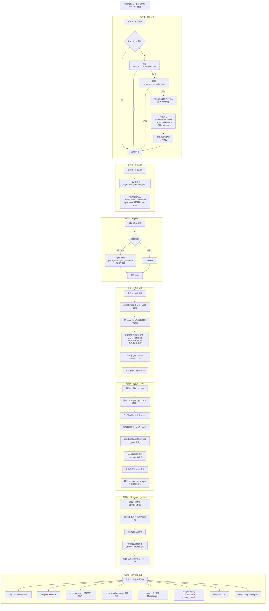
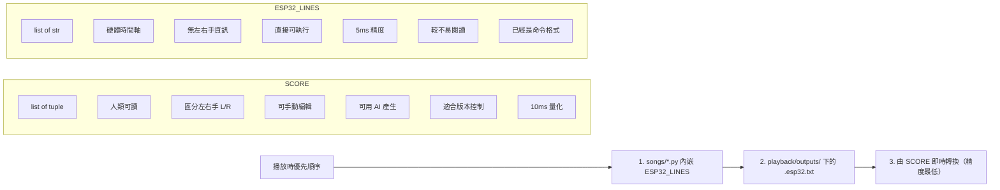
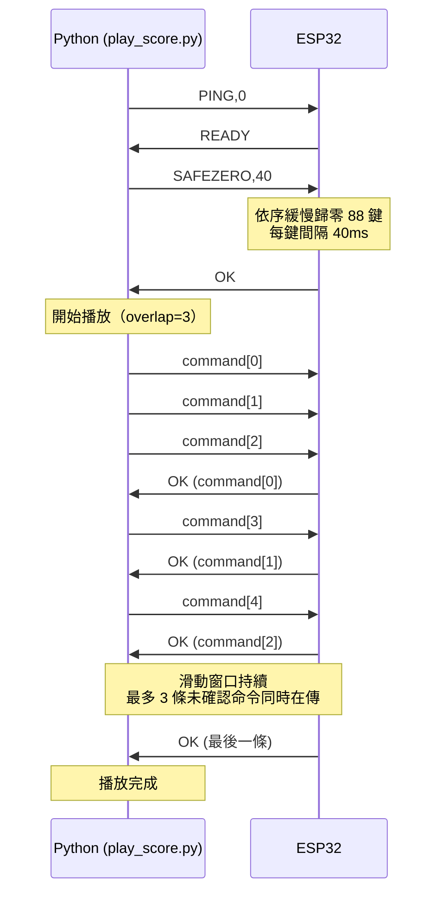
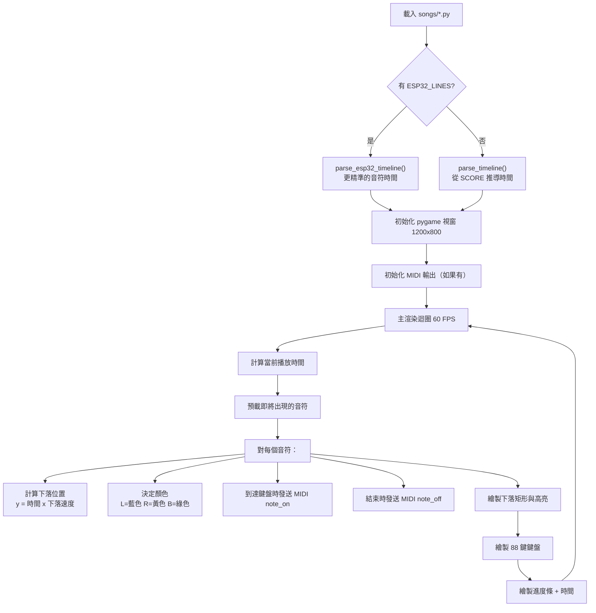
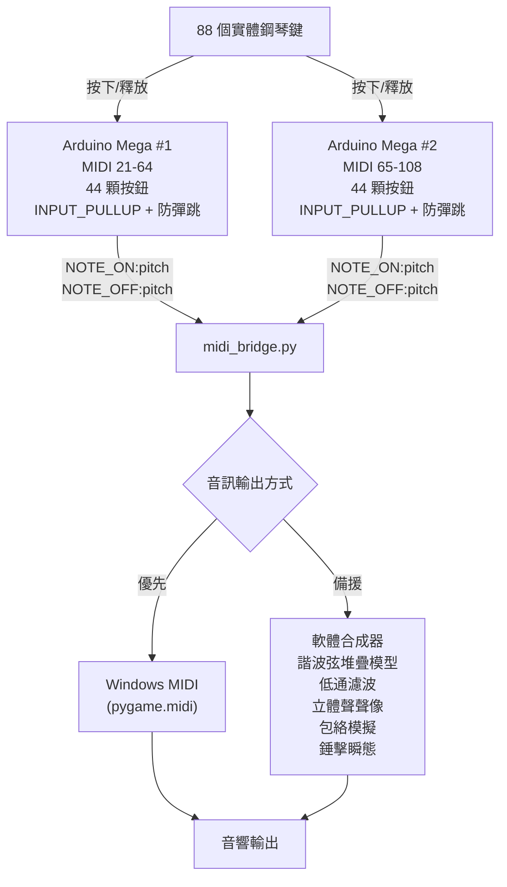
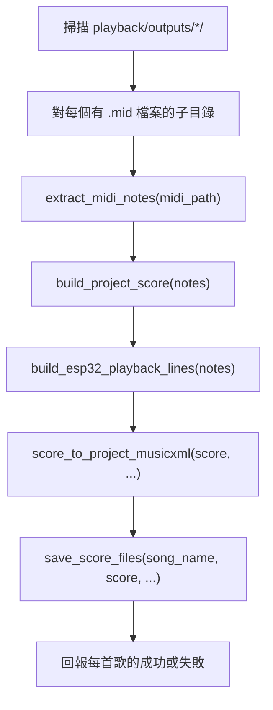

# Auto Piano - 自動鋼琴系統

Auto Piano 是一套完整的鋼琴自動化系統，能夠將任何來源的鋼琴音樂轉換為可播放的資產，支援軟體視覺化模擬和 ESP32 控制的 88 鍵伺服機構進行真實機械演奏。

系統涵蓋從 YouTube 音訊下載、AI 鋼琴轉譜、樂譜產生、視覺模擬到即時硬體控制的完整流程。

---

## 目錄

- [安裝教學](#安裝教學)
- [快速開始](#快速開始)
- [專案概述](#專案概述)
- [系統架構](#系統架構)
- [倉庫結構](#倉庫結構)
- [硬體架構](#硬體架構)
- [入口與啟動器](#入口與啟動器)
- [轉譜流程](#轉譜流程)
- [樂譜資料格式](#樂譜資料格式)
- [ESP32 韌體協定](#esp32-韌體協定)
- [視覺化播放](#視覺化播放)
- [硬體播放](#硬體播放)
- [按鈕子系統](#按鈕子系統)
- [馬達校正](#馬達校正)
- [設定檔](#設定檔)
- [歌曲檔與輸出資產](#歌曲檔與輸出資產)
- [工具](#工具)
- [AI 編曲規則](#ai-編曲規則)
- [依賴項](#依賴項)
- [已知注意事項](#已知注意事項)

---

## 安裝教學

### 環境需求

| 項目 | 需求 |
| --- | --- |
| 作業系統 | Windows 10 / 11 |
| Python 版本 | 3.11（安裝腳本會自動安裝） |
| GPU | NVIDIA 顯示卡 + CUDA 12.1（用於 ByteDance 轉譜模型） |
| 網路 | 首次使用需下載模型檔案（約 160MB） |
| 磁碟空間 | 建議至少 5GB（含虛擬環境和模型） |

### 第一步：複製倉庫

```bash
git clone https://github.com/wjmmmwjj/auto_piano.git
cd auto_piano
```

### 第二步：執行安裝腳本

在專案根目錄雙擊 `install.bat`，或在命令列執行：

```bash
install.bat
```

安裝腳本會自動完成以下所有工作：

```
install.bat 執行流程
====================

  開始
    |
    v
  [檢查 .venv311\Scripts\python.exe 是否存在]
    |-- 存在 --> 跳過 Python 安裝
    |-- 不存在 -->
          [嘗試 py -3.11]
            |-- 找到 --> 使用 py -3.11
            |-- 找不到 -->
                  [用 winget 自動安裝 Python 3.11]
                    |-- 成功 --> 繼續
                    |-- 失敗 --> 需要手動安裝 Python 3.11
    |
    v
  [建立 .venv311 虛擬環境]
    |
    v
  [升級 pip / setuptools<82 / wheel]
    |
    v
  [安裝 PyTorch CUDA 12.1]
  torch>=2.0.0, torchaudio>=2.0.0, torchvision>=0.15.0
  來源: https://download.pytorch.org/whl/cu121
    |
    v
  [安裝 playback/requirements.txt + pygame]
  包含: yt-dlp, pretty_midi, music21, pyserial,
        requests, imageio-ffmpeg, piano_transcription_inference,
        basic-pitch, pydub, moduleconf
    |
    v
  [安裝 transkun（--no-deps）]
    |
    v
  安裝完成
  可以執行 run_score.bat / run_visualizer.bat / sound.bat / tool.bat
```

### 第三步：驗證安裝

安裝完成後，執行以下命令確認環境正確：

```bash
run_score.bat
```

如果看到選單畫面（播放已有歌曲 / 查歌並自動轉譜 / 離開），表示安裝成功。

### 手動安裝 Python 3.11（如果自動安裝失敗）

1. 前往 https://www.python.org/downloads/release/python-3119/
2. 下載 Windows installer (64-bit)
3. 安裝時勾選 "Add Python to PATH"
4. 安裝完成後重新執行 `install.bat`

### 常見安裝問題排除

| 問題 | 解決方式 |
| --- | --- |
| `winget` 不存在 | 手動安裝 Python 3.11 後重新執行 `install.bat` |
| PyTorch 安裝失敗 | 確認 NVIDIA 驅動已更新到支援 CUDA 12.1 的版本 |
| `transkun` 安裝失敗 | 通常是網路問題，請重新執行 `install.bat` |
| 模型下載失敗 | 首次執行轉譜時會自動下載，確認網路連線正常 |
| 防毒軟體攔截 | 將專案目錄加入白名單 |

---

## 快速開始

```
1. 安裝環境
   install.bat

2. 從 YouTube 轉譜
   run_score.bat
   --> 選擇 [2] 查歌並自動轉譜
   --> 輸入歌曲名稱或 YouTube 網址
   --> 等待轉譜完成
   --> 選擇 [1] 模擬播放 或 [2] 真實彈奏

3. 播放已有歌曲（視覺模擬）
   run_visualizer.bat
   --> 選擇 songs/ 目錄下的 .py 檔案

4. 播放已有歌曲（實體鋼琴）
   run_score.bat
   --> 選擇 [1] 播放已有歌曲
   --> 選擇歌曲
   --> 連接 ESP32（自動偵測）
   --> 開始播放

5. 校正伺服馬達
   （先將 motor_control_tool.ino 燒錄到 ESP32）
   tool.bat
   --> 輸入: <midi> <release角度> <press角度>
   --> 角度會自動寫回 motor_control.ino
```

---

## 專案概述

Auto Piano 有兩條主要流程線：

**轉譜流程線**
從歌曲名稱或 YouTube 網址出發，找到音源、下載音訊、進行 AI 鋼琴轉譜、產生 MIDI，再將 MIDI 轉換為專案自己的 `SCORE`、`ESP32_LINES`、MusicXML、PDF 與 `songs/*.py`。

**硬體播放流程線**
將已有的 `songs/*.py` 或 `.esp32.txt` 命令檔傳送到 ESP32，由 ESP32 控制 88 個伺服機構按下實體鋼琴鍵。


---

## 系統架構



---

## 倉庫結構

```
auto_piano/
|
|-- install.bat                    環境安裝腳本
|-- run_score.bat                  互動式主入口啟動器
|-- run_visualizer.bat             視覺化播放啟動器
|-- sound.bat                      按鈕轉 MIDI 橋接啟動器
|-- tool.bat                       馬達校正工具啟動器
|-- AI_composition_rules.txt       AI 編曲與轉譜規則
|
|-- apps/
|   |-- launcher.py                主互動入口
|   |-- visualize_score.py         Synthesia 風格鋼琴視覺化播放器
|   |-- piano_motor_tuner.py       互動式伺服角度校正工具
|   |-- dashboard.py               儀表板應用
|
|-- playback/
|   |-- song_workflow.py           核心轉譜管線（最大的檔案）
|   |-- play_score.py              硬體播放（傳送命令到 ESP32）
|   |-- project_score_tools.py     SCORE 格式輔助函式與轉換器
|   |-- esp32_serial.py            序列埠偵測與探測
|   |-- model_runtime_config.json  模型與裝置設定
|   |-- song_aliases.json          歌曲別名字典
|   |-- song_source_overrides.json 手動指定 YouTube 網址
|   |-- song_source_cache.json     搜尋結果快取
|   |-- requirements.txt           Python 套件需求
|   |-- outputs/                   執行時期產出（已列入 gitignore）
|
|-- songs/
|   |-- *.py                       歌曲檔（包含 28 首範例歌曲）
|
|-- esp32/
|   |-- motor_control/
|   |   |-- motor_control.ino      正式 88 鍵播放韌體
|   |-- motor_control_tool/
|   |   |-- motor_control_tool.ino 校正用韌體
|   |-- reset_all/
|       |-- reset_all.ino          重置/測試韌體
|
|-- button/
|   |-- mega_buttons_1/
|   |   |-- mega_buttons_1.ino     Arduino Mega #1（MIDI 21-64）
|   |-- mega_buttons_2/
|   |   |-- mega_buttons_2.ino     Arduino Mega #2（MIDI 65-108）
|   |-- mega_pin_tester/           腳位測試韌體
|   |-- midi_bridge.py             按鈕轉 MIDI 橋接（Python）
|
|-- tools/
|   |-- rebuild_all_songs.py       批次從現有 MIDI 重建所有歌曲
|   |-- ino_config_editor.py       編輯 motor_control.ino 角度表
|
|-- archive/                       舊版原型檔案
|-- docs/                          文件資料
|-- .models/                       模型權重檔（已列入 gitignore）
|-- .venv311/                      Python 3.11 虛擬環境（已列入 gitignore）
```

---

## 硬體架構


**硬體規格：**

| 項目 | 規格 |
| --- | --- |
| MIDI 音域 | 21 (A0) 到 108 (C8)，完整 88 鍵 |
| 伺服通道數 | 88 |
| PCA9685 板 | 6 塊（I2C 位址 0x40 到 0x45） |
| 白鍵按下角度 | 30 度 |
| 黑鍵按下角度 | 40 度 |
| 所有鍵釋放角度 | 0 度 |
| Arduino Mega 按鈕板 | 2 塊（用於實體按鍵偵測） |

---

## 入口與啟動器

### run_score.bat - 互動式主入口

啟動 `apps/launcher.py`。



### run_visualizer.bat - 視覺化播放

啟動 `apps/visualize_score.py`。

- 如果沒有給參數，會開啟檔案選擇對話框
- 載入 `songs/*.py` 並以 Synthesia 風格渲染下落音符，60 FPS
- 如果檔案內有 `ESP32_LINES` 則優先使用（時間更精準），否則退回 `SCORE`
- 左手顯示藍色、右手顯示黃色、雙手顯示綠色
- 顯示進度條與時間計數器
- 如果系統有預設 MIDI 輸出裝置，會同步發聲

### sound.bat - 按鈕轉 MIDI 橋接

啟動 `button/midi_bridge.py`。



### tool.bat - 馬達校正

啟動 `apps/piano_motor_tuner.py`。



---

## 轉譜流程

核心實作在 `playback/song_workflow.py`。



### 轉譜提供者

| 提供者 | 模式 | 目前狀態 |
| --- | --- | --- |
| ByteDance piano_transcription_inference | full / auto | 預設主路徑 |
| Transkun | quick | 可用（快速模式） |
| HuggingFace 遠端 | - | 程式碼存在，非預設 |
| Songscription.ai | - | 程式碼存在，非預設 |
| Basic Pitch | 僅用於驗證 | 用於品質評分 |

---

## 樂譜資料格式

專案使用兩種內部資料格式，各有互補用途。

### SCORE 格式

`SCORE` 是 `list[tuple]`，以人類可讀、區分左右手的格式呈現音樂內容。設計目標是方便編輯、版本控制和 AI 產生。

```python
from playback.project_score_tools import r, n, c, a, ln, rn, lc, rc, la, ra

SCORE = [
    r(120),                        # 休止 120ms
    ln("C3", 600),                 # 左手音符 C3, 600ms
    rn("C5", 600),                 # 右手音符 C5, 600ms
    rc("C5 E5 G5", 900),           # 右手和弦, 900ms
    ra("C5 E5 G5 C6", 800, [0, 20, 40, 60], 10),  # 右手分解和弦
]
```

**輔助函式：**

| 函式 | 說明 |
| --- | --- |
| `r(ms)` | 休止 |
| `n(pitch, ms)` | 單音（無分手） |
| `c(pitches, ms)` | 和弦（無分手） |
| `a(pitches, ms, offsets, release_ms)` | 分解和弦（無分手） |
| `ln(pitch, ms)` | 左手單音 |
| `rn(pitch, ms)` | 右手單音 |
| `lc(pitches, ms)` | 左手和弦 |
| `rc(pitches, ms)` | 右手和弦 |
| `la(pitches, ms, offsets, release_ms)` | 左手分解和弦 |
| `ra(pitches, ms, offsets, release_ms)` | 右手分解和弦 |

**可接受的音高格式：**
- MIDI 整數：`60`
- 音名：`"C4"`、`"G#3"`、`"Eb4"`
- 多音字串：`"C4 E4 G4"`

**原始 tuple 類型對照：**

| kind | tuple 形式 | 說明 |
| --- | --- | --- |
| 0 | `(0, duration_ms)` | 休止 |
| 1 | `(1, pitch, duration_ms)` | 單音 |
| 3 | `(3, [p1, p2, ...], duration_ms)` | 和弦 |
| 4 | `(4, [p1, p2, ...], duration_ms, offsets_ms, release_ms)` | 分解和弦 |
| 10 | `(10, 'L'/'R', pitch, duration_ms)` | 左右手單音 |
| 11 | `(11, 'L'/'R', [p1, p2, ...], duration_ms)` | 左右手和弦 |
| 12 | `(12, 'L'/'R', [p1, p2, ...], duration_ms, offsets_ms, release_ms)` | 左右手分解和弦 |

**project_score_tools.py 的正規化規則：**
- 音高範圍限制在 MIDI 21-108
- 時值量化到 10ms 步進
- 最短音長保底 100ms（用於新產生樂譜）
- 和弦最多 12 個音
- 分解和弦 offset 正規化：最小 5ms，最大展開 120ms
- 合併相鄰休止
- 重複同音給予機械 release 間隙（15-60ms）

### ESP32_LINES 格式

`ESP32_LINES` 是 `list[str]`，直接代表硬體命令時間軸。設計目標是精準播放，無需再解讀。

```
WAIT,120
ON,60+64+67
WAIT,90
OFF,60+64+67
WAIT,50
ON,72
WAIT,400
OFF,72
```

**命令：**

| 命令 | 說明 |
| --- | --- |
| `WAIT,<ms>` | 等待指定毫秒 |
| `ON,<p1+p2+...>` | 同時按下一個或多個鍵 |
| `OFF,<p1+p2+...>` | 同時釋放一個或多個鍵 |

**特性：**
- 時間軸精度：5ms 量化
- 直接從 MIDI 音符事件時間戳建立
- 保留原始轉譜的精確音符起止時間
- 比從 SCORE 反推時間更精準

### SCORE 與 ESP32_LINES 的比較



---

## ESP32 韌體協定

正式韌體位於 `esp32/motor_control/motor_control.ino`。

### 鍵對照表結構

`N[][7]` 表的每一列：

```
{MIDI, board, channel, p0, p180, press_angle, release_angle}
```

| 欄位 | 說明 |
| --- | --- |
| `MIDI` | MIDI 音高編號（21-108） |
| `board` | PCA9685 板索引（0-5） |
| `channel` | 該板上的通道（0-15） |
| `p0` | 對應 0 度的 PWM 脈寬 |
| `p180` | 對應 180 度的 PWM 脈寬 |
| `press_angle` | 按下時角度（白鍵 30，黑鍵 40） |
| `release_angle` | 釋放時角度（所有鍵均為 0） |

### 韌體支援的命令

| 命令 | 回應 | 說明 |
| --- | --- | --- |
| `PING,0` | `READY` | 握手 / 健康檢查 |
| `SAFEZERO,<ms>` | `OK` | 緩慢歸零所有 88 鍵，每鍵間隔 ms |
| `WAIT,<ms>` | `OK` | 等待指定毫秒 |
| `ON,<p1+p2+...>` | `OK` | 按下一個或多個鍵 |
| `OFF,<p1+p2+...>` | `OK` | 釋放一個或多個鍵 |
| `NOTE,<pitch>,<ms>` | `OK` | 單音播放 |
| `CHORD,<p1+p2+...>,<ms>` | `OK` | 和弦播放 |
| `ARP,<notes>,<ms>,<offsets>,<release_ms>` | `OK` | 分解和弦播放 |
| `L:...` / `R:...` | `OK` | 左右手前綴（韌體當作一般命令解析） |

錯誤回應：`ERR:<訊息>`
資訊訊息：`INFO:<訊息>`、`WARN:<訊息>`

### 命令管線協定



`overlap=3` 參數表示最多 3 條未被確認的命令同時在傳輸中，避免序列延遲造成播放時間間隙。

---

## 視覺化播放

`apps/visualize_score.py` 渲染 Synthesia 風格的下落音符視覺化。



**視窗佈局：**
- 上方區域（0 到 650px）：音符下落區
- 進度條：頂部（y=18，高 18px）
- 鍵盤：視窗底部 150px
- 下落速度：0.6 像素/毫秒

---

## 硬體播放

`playback/play_score.py` 負責將命令傳送到 ESP32。


---

## 按鈕子系統

按鈕子系統讓實體鋼琴按鍵觸發 MIDI 輸出，使用兩塊 Arduino Mega。



**Arduino 韌體特色（mega_buttons_1/2.ino）：**
- 所有按鈕腳位使用 `INPUT_PULLUP`
- 硬體防彈跳，可設定最小按壓間隔
- 啟動橫幅：`READY - Arduino Mega #N - MIDI start-end`
- 輸出格式：`NOTE_ON:<pitch>` 和 `NOTE_OFF:<pitch>`

**軟體合成器特色（midi_bridge.py SoftwareSynthOutput）：**
- 諧波弦堆疊模型（7 個諧波）
- 非諧性模擬
- 低通濾波（音色溫暖化）
- 依 MIDI 音高做立體聲聲像定位
- attack、body decay、brightness decay 包絡
- 錘擊雜訊瞬態模擬
- 重觸時交叉淡出

---

## 馬達校正


---

## 設定檔

### playback/model_runtime_config.json

```json
{
  "prefer_device": "auto",
  "bytedance_checkpoint_path": ".models/piano_transcription_inference-1.0.0-2020-09-16.pth",
  "transkun_command": "",
  "midi2scoretransformer_command": ""
}
```

| 欄位 | 可選值 | 說明 |
| --- | --- | --- |
| `prefer_device` | `auto`, `cpu`, `cuda` | 推理裝置選擇 |
| `bytedance_checkpoint_path` | 相對或絕對路徑 | ByteDance 模型權重路徑 |
| `transkun_command` | 命令字串或空白 | 自訂 transkun 呼叫方式（空白則自動偵測） |
| `midi2scoretransformer_command` | 命令範本或空白 | 選用的後處理工具命令 |

`midi2scoretransformer_command` 支援的佔位符：
`{midi_path}`、`{output_musicxml_path}`、`{output_dir}`、`{song_name}`、`{safe_name}`

### playback/song_aliases.json

定義已知歌曲的替代搜尋名稱與評分關鍵字。

```json
{
  "黑鍵練習曲": {
    "aliases": ["Chopin Black Key Etude", "Chopin Etude Op.10 No.5"],
    "search_queries": ["黑鍵練習曲 肖邦 鋼琴獨奏"],
    "preferred_terms": ["黑鍵練習曲", "Chopin", "Etude"],
    "blocked_terms": ["JJ Lin", "林俊傑"]
  }
}
```

### playback/song_source_overrides.json

手動將歌曲名稱固定到特定 YouTube 網址，跳過搜尋。

### playback/song_source_cache.json

自動維護的 YouTube 搜尋結果快取，避免重複搜尋。

---

## 歌曲檔與輸出資產

### songs/*.py 格式

`songs/` 下的每個歌曲檔都是 Python 模組，包含 `SCORE` 及選用的 `ESP32_LINES`。

```python
from playback.project_score_tools import r, n, c, a, ln, rn, lc, rc, la, ra

SCORE = [
    r(120),
    ln("C3", 600),
    rn("C5", 600),
    rc("C5 E5 G5", 900),
]

ESP32_LINES = [
    "WAIT,120",
    "ON,48",
    "ON,72",
    "WAIT,600",
    "OFF,48+72",
    "ON,72+76+79",
    "WAIT,900",
    "OFF,72+76+79",
]
```

**目前包含 28 首範例歌曲，例如：**
- River Flows In You
- Moonlight Sonata 3rd Movement（月光奏鳴曲 第三樂章）
- Evangelion（新世紀福音戰士）
- Rush E
- Interstellar Experience（星際效應）
- NewJeans
- YOASOBI - Idol（偶像）
- Night of Knights
- Croatian Rhapsody（克羅埃西亞狂想曲）
- Liszt - La Campanella（李斯特 - 鐘）
- 天空之城
- 菊次郎的夏天
- 大黃蜂
- 冬風
- 小狗圓舞曲
- 黑鍵練習曲
- 等等

### playback/outputs/< song >/ 結構

每次轉譜會在對應目錄產生一整組資產：

```
playback/outputs/<safe_song_name>/
|-- <song>.source-url.txt              使用的 YouTube 網址
|-- <song>.source-info.json            YouTube 後設資料
|-- <song>.wav 或 <song>.mp3           下載的音訊
|-- <song>.mid                         轉譜產生的原始 MIDI
|-- <song>.raw.musicxml                由原始 MIDI 直接轉出
|-- <song>.musicxml                    含左右手重建的版本
|-- <song>.formal.musicxml             選用：後處理版本
|-- <song>.pdf                         選用：PDF 樂譜（需要 MuseScore）
|-- <song>.esp32.txt                   硬體命令時間軸
|-- <song>.quality-report.json         轉譜品質信心報告
|-- <song>.candidate-summary.json      多提供者比較資料
|-- _validation/                       驗證用音訊片段
```

### .gitignore

以下內容排除在版本控制之外：
- `.venv*/` - 虛擬環境
- `.models/` - 模型權重檔
- `playback/outputs/` - 所有執行時期轉譜產出
- `__pycache__/` - Python 位元碼快取
- `config/_songscription_*.json` - 私密 API 會話資料

---

## 工具

### tools/rebuild_all_songs.py

從 `playback/outputs/` 內現有的 MIDI 檔案批次重建所有歌曲資產。適用於修改 `build_project_score()` 或 `build_esp32_playback_lines()` 邏輯後的批次更新。



### tools/ino_config_editor.py

離線編輯 `motor_control.ino` 伺服角度表。可以在沒有連接 ESP32 的情況下編輯每個 MIDI 鍵的 board、channel、press、release 值。存檔前會建立 `.bak` 備份。

---

## AI 編曲規則

`AI_composition_rules.txt` 定義了轉譜精確度與手動樂譜編輯的標準規則。主要原則：

**音樂優先順序：**
1. 旋律精確度與辨識度是最高優先
2. 鋼琴可演奏性優先於機械完整性
3. 對於非鋼琴來源，產生合理的鋼琴改編版

**時間規則：**
- SCORE 量化：10ms 基本單位
- ESP32 精度：5ms
- 最短建議音長：40ms
- 最長音長：30000ms
- 休止不可全部刪除，節奏空間必須保留

**左右手分配：**
- 低音區：優先左手
- 高音區：優先右手
- 中間音：依上下文判斷
- 密集時優先順序：主旋律 > 低音根音 > 和聲色彩音 > 內聲

**機構限制：**
- 白鍵按下角度：30 度
- 黑鍵按下角度：40 度
- 所有鍵釋放角度：0
- 每次播放前必須先 SAFEZERO
- 快速重打須考慮伺服回彈極限

---

## 依賴項

### Python 套件（由 install.bat 安裝）

| 套件 | 用途 |
| --- | --- |
| `torch`, `torchaudio`, `torchvision` | ByteDance 模型的 CUDA 推理 |
| `piano_transcription_inference` | ByteDance 轉譜模型 |
| `transkun` | Transkun 轉譜模型 |
| `basic-pitch` | 用於品質驗證的參考轉譜 |
| `yt-dlp` | YouTube 搜尋與音訊下載 |
| `pretty_midi` | MIDI 檔案解析 |
| `music21` | MusicXML 產生 |
| `pyserial` | 與 ESP32 和 Arduino 的序列通訊 |
| `pygame` | 視覺化渲染與 MIDI 輸出 |
| `imageio-ffmpeg` | 音訊格式轉換 |
| `pydub` | 音訊前處理 |
| `requests` | HTTP 操作 |
| `moduleconf` | 模組設定 |
| `numpy` | 音訊合成（軟體鋼琴） |

### 額外執行時期依賴

| 套件 | 使用位置 | 備註 |
| --- | --- | --- |
| `librosa` | song_workflow 部分路徑 | 未列在 requirements.txt |
| `gradio_client` | HuggingFace 路徑（非預設） | 選用 |
| `playwright` | Songscription 路徑（非預設） | 選用 |

### Arduino / 硬體

| 元件 | 函式庫 / 韌體 |
| --- | --- |
| ESP32 | Wire.h (I2C)，自訂 PCA9685 控制 |
| PCA9685 | 直接 I2C 暫存器寫入 |
| Arduino Mega | 標準 Arduino 函式庫 |

---

## 已知注意事項

**轉譜模式映射**
`song_workflow.py` 中的 `auto` 模式在 `transcribe_audio()` 開頭就被直接改成 `full`。這表示 `auto` 和 `full` 目前完全等價，都使用 ByteDance 作為唯一的主動提供者。多候選比較邏輯存在於程式碼中，但在預設 launcher 路徑中不會被觸發。

**HuggingFace 與 Songscription 路徑**
`transcribe_with_huggingface()` 和 `transcribe_with_songscription()` 已在 `song_workflow.py` 中實作，但不會被預設 launcher 流程呼叫。如需重新啟用，須更新 `transcribe_audio()` 中的模式分派邏輯。

**缺少的依賴宣告**
部分執行時期使用的套件（`librosa`、`gradio_client`、`playwright`）未列在 `playback/requirements.txt` 中。它們或是作為間接依賴被安裝，或屬於非預設的程式碼路徑。

**ByteDance 模型下載**
模型檢查點（約 160MB）在首次使用時會從 Zenodo 或 HuggingFace 自動下載。下載前會驗證 SHA256 校驗碼。失敗或不完整的下載會被偵測到並重新下載。

**PDF 匯出需要 MuseScore**
PDF 匯出需要安裝 MuseScore 3 或 4。系統會自動搜尋標準安裝路徑。如果找不到，PDF 產生會靜默跳過。

**僅支援 Windows**
本專案嚴格為 Windows 設計。`install.bat`、MIDI 橋接中的 `winmm` API、`winget` Python 安裝、以及所有 `.bat` 啟動器都是 Windows 專用。

**校正韌體**
馬達校正工具（`tool.bat`）需要將 `motor_control_tool.ino` 燒錄到 ESP32。正式的 `motor_control.ino` 韌體不支援 `S,<midi>,<angle>` 或 `H,<midi>,<release>,<press>` 校正命令。
