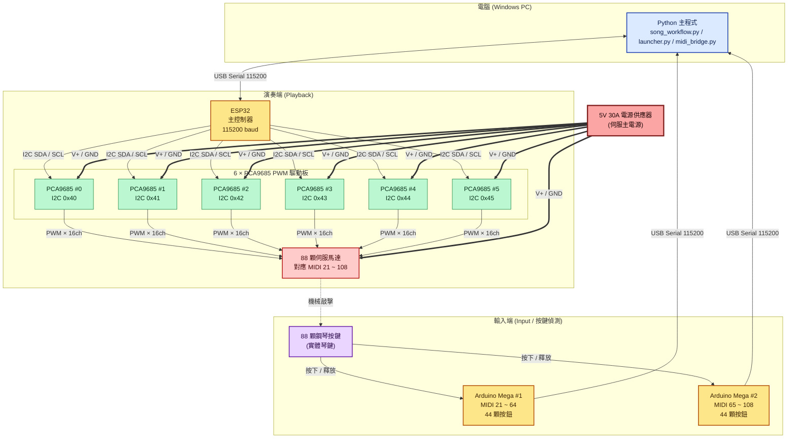

# Auto Piano 硬體架構圖

本文件描述 Auto Piano 系統的硬體連接方式，包含演奏端（ESP32 + PCA9685 + 伺服馬達）與輸入端（Arduino Mega + 按鍵）。

## 整體架構

## 元件清單

| 元件 | 數量 | 用途 |
|------|------|------|
| Windows PC | 1 | 跑 Python 轉譜 / 播放管線（song_workflow.py、launcher.py、midi_bridge.py） |
| ESP32 | 1 | 主控制器，透過 USB Serial 115200 接收電腦命令，發送 I2C 給 PCA9685 |
| PCA9685 PWM 板 | 6 | I2C 位址 0x40 ~ 0x45，每塊 16 通道 PWM，共可驅動 96 顆伺服 |
| 伺服馬達 | 88 | 對應 MIDI 21 ~ 108，機械敲擊鋼琴鍵 |
| Arduino Mega | 2 | #1 偵測 MIDI 21 ~ 64、#2 偵測 MIDI 65 ~ 108，各 44 顆按鈕 |
| 5V 30A 電源供應器 | 1 | 提供伺服與 PCA9685 邏輯電源（共 88 顆伺服的尖峰電流） |

## 訊號流向

### 播放流程（PC → 鋼琴）
1. PC 上 Python 解析 SCORE / ESP32_LINES。
2. 透過 USB Serial（115200 baud）送 ON / OFF / WAIT 命令到 ESP32。
3. ESP32 用 I2C 對 6 塊 PCA9685 寫入 PWM duty。
4. PCA9685 輸出 PWM 訊號給 88 顆伺服。
5. 伺服旋轉到 press / release 角度，物理敲擊琴鍵。

### 輸入流程（鋼琴 → PC）
1. 使用者按下實體鍵。
2. Arduino Mega 用 INPUT_PULLUP + 防彈跳偵測。
3. 透過 USB Serial 把按鍵事件送回 PC。
4. midi_bridge.py 轉換為 MIDI 並輸出聲音。

## 電源注意事項

- **5V 30A 電源供應器** 只給伺服與 PCA9685 的 V+ 用，**不要**接到 ESP32 / Arduino 的邏輯電源（避免突波回灌）。
- ESP32 與 Arduino Mega 透過 USB 供電。
- 所有 GND 必須共地，PCA9685 的 V+ 與邏輯 VCC 分離。
- 88 顆伺服同時動作時的尖峰電流接近 30A，需確認電源線徑與接線端子能承受。
