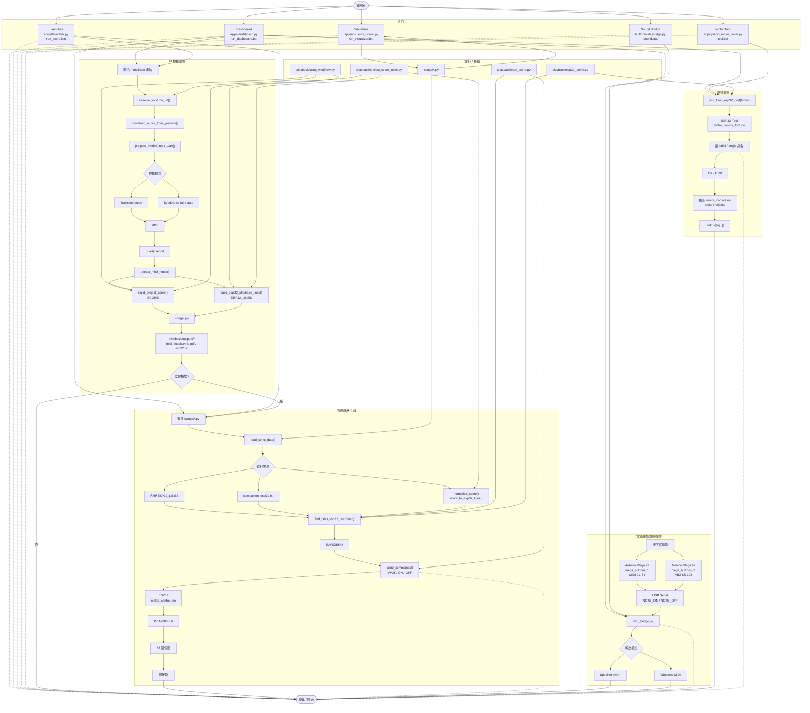

```mermaid
flowchart TD
    User([使用者])
    Stop([停止 / 結束])

    subgraph Entry["入口"]
        Dashboard["Dashboard\napps/dashboard.py\nrun_dashboard.bat"]
        Launcher["Launcher\napps/launcher.py\nrun_score.bat"]
        Visualizer["Visualizer\napps/visualize_score.py\nrun_visualizer.bat"]
        BridgeEntry["Sound Bridge\nbutton/midi_bridge.py\nsound.bat"]
        TunerEntry["Motor Tool\napps/piano_motor_tuner.py\ntool.bat"]
    end

    subgraph Transcribe["AI 轉譜主線"]
        Query["歌名 / YouTube 連結"]
        Resolve["resolve_youtube_url()"]
        Download["download_audio_from_youtube()"]
        Prepare["prepare_model_input_wav()"]
        Mode{"轉譜模式"}
        Quick["Transkun quick"]
        Full["ByteDance full / auto"]
        Midi["MIDI"]
        Quality["quality report"]
        Notes["extract_midi_notes()"]
        Score["build_project_score()\nSCORE"]
        Lines["build_esp32_playback_lines()\nESP32_LINES"]
        SongFile["songs/<song>.py"]
        Outputs["playback/outputs/<song>/\nmid / musicxml / pdf / esp32.txt"]
        PlayNow{"立即播放?"}
    end

    subgraph Playback["實體播放主線"]
        PickSong["選擇 songs/*.py"]
        LoadSong["load_song_data()"]
        DataChoice{"資料來源"}
        Embedded["內嵌 ESP32_LINES"]
        Companion["companion .esp32.txt"]
        Convert["normalize_score()\nscore_to_esp32_lines()"]
        ProbeMain["find_best_esp32_port(main)"]
        SafeZero["SAFEZERO"]
        SendCmd["send_commands()\nWAIT / ON / OFF"]
        ESP32Main["ESP32\nmotor_control.ino"]
        PCA["PCA9685 x 6"]
        Servos["88 個伺服"]
        Piano["鋼琴鍵"]
    end

    subgraph ButtonSound["實體按鍵即時發聲"]
        PressKey["按下實體鍵"]
        Mega1["Arduino Mega #1\nmega_buttons_1\nMIDI 21-64"]
        Mega2["Arduino Mega #2\nmega_buttons_2\nMIDI 65-108"]
        SerialNote["USB Serial\nNOTE_ON / NOTE_OFF"]
        Bridge["midi_bridge.py"]
        Backend{"輸出模式"}
        Speaker["Speaker synth"]
        WinMidi["Windows MIDI"]
    end

    subgraph Tuning["調校主線"]
        ProbeTuner["find_best_esp32_port(tuner)"]
        ESP32Tool["ESP32 Tool\nmotor_control_tool.ino"]
        TuneCmd["送 MIDI / angle 指令"]
        TuneResp["OK / ERR"]
        EditIno["更新 motor_control.ino\npress / release"]
        Backup[".bak / 參考表"]
    end

    subgraph DataLayer["資料 / 模組"]
        SerialHelper["playback/esp32_serial.py"]
        ScoreTools["playback/project_score_tools.py"]
        Workflow["playback/song_workflow.py"]
        PlayScore["playback/play_score.py"]
        SongBank["songs/*.py"]
    end

    User --> Dashboard
    User --> Launcher
    User --> Visualizer
    User --> BridgeEntry
    User --> TunerEntry

    Dashboard --> Query
    Dashboard --> PickSong
    Dashboard --> Bridge
    Dashboard --> ProbeTuner
    Dashboard -.-> Stop

    Launcher --> Query
    Launcher --> PickSong
    Launcher -.-> Stop

    Visualizer --> SongBank
    Visualizer -.-> Stop

    BridgeEntry --> Bridge
    BridgeEntry -.-> Stop

    TunerEntry --> ProbeTuner
    TunerEntry -.-> Stop

    Query --> Resolve --> Download --> Prepare --> Mode
    Mode --> Quick --> Midi
    Mode --> Full --> Midi
    Midi --> Quality --> Notes
    Notes --> Score
    Notes --> Lines
    Score --> SongFile
    Lines --> SongFile
    SongFile --> Outputs
    Outputs --> PlayNow
    PlayNow -->|是| PickSong
    PlayNow -->|否| Stop

    PickSong --> LoadSong --> DataChoice
    DataChoice --> Embedded --> ProbeMain
    DataChoice --> Companion --> ProbeMain
    DataChoice --> Convert --> ProbeMain
    ProbeMain --> SafeZero --> SendCmd --> ESP32Main --> PCA --> Servos --> Piano --> Stop
    SendCmd -.-> Stop

    PressKey --> Mega1 --> SerialNote
    PressKey --> Mega2 --> SerialNote
    SerialNote --> Bridge --> Backend
    Backend --> Speaker --> Stop
    Backend --> WinMidi --> Stop
    Bridge -.-> Stop

    ProbeTuner --> ESP32Tool --> TuneCmd --> TuneResp --> EditIno --> Backup --> Stop
    TuneCmd -.-> Stop

    Workflow --> Resolve
    Workflow --> Score
    Workflow --> Lines
    PlayScore --> ProbeMain
    PlayScore --> SendCmd
    ScoreTools --> Convert
    ScoreTools --> Score
    ScoreTools --> Lines
    SerialHelper --> ProbeMain
    SerialHelper --> ProbeTuner
    SongBank --> LoadSong
    SongBank --> Visualizer
```
